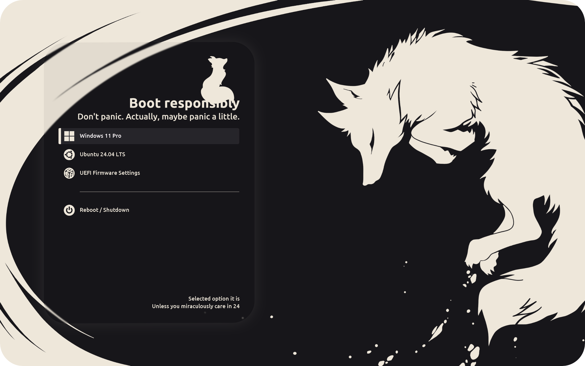

# Monochrome GRUB Theme
Well kinda monochrome but whatever



## Install
#### Clone the repo
```
git clone https://github.com/mosphox/monochrome-grub-theme.git
```
(Or just download and unzip it anywhere)

#### Get into the folder
```
cd monochrome-grub-theme
```
You might need to add `-main` at the end, if it was downloaded as `.zip`

#### Run
```
sudo chmod +x install.sh
bash ./install.sh
```
#### Reboot to check if anything changed

## Scaling stuff
- This was designed for a `3200×2000` resolution (`16:10` ratio), so the background image might (well, actually will) look a bit squished on `16:9` monitors.

- Logos should work fine as long as your resolution isn’t too small.
They’re aligned pretty much perfectly for `3200×2000`, but they might drift slightly on other resolutions — even ones that are close enough.
Hopefully it’s not too bad.

- Fonts are probably the most scale-proof thing in the entire theme.
But hey — if you want to tweak their size, you totally can.
Check the [Replacing Fonts](https://github.com/mosphox/monochrome-grub-theme?tab=readme-ov-file#replacing-fonts) section below for more details on how to ruin the layout.

## A little note about everything that's written below
This `README` was mostly written for future me — y’know, just in case I mess something up and have to reinstall everything from scratch.
So yeah, you might find the rest of it a bit over-explained or unnecessarily detailed.
Most of what follows is pretty irrelevant unless you’re into tweaking stuff for fun or you're trying to figure out how something works.

So yeah, feel free to skip the rest.

Unless, of course, you want to read it.

## Editing
There’s a `theme.txt` file inside (obviously), packed with all the stuff that makes this theme tick.

#### Here’s what you might actually want to tweak:

- Change the line `"Booting selected OS"` to match your GRUB default entry.

- Labels are positioned right in the center of the boot menu, so you can align them however you like.
Valid options are `"left"`, `"center"`, and `"right"` — in case you want your bootloader to express itself.

- The terminal box is placed in the center, inside a kinda fading-out frame.
If you’d rather just have a clean black fullscreen terminal, replace this in your `theme.txt`:

  ```
  terminal-left: "0%"
  terminal-top: "0%"
  terminal-width: "100%"
  terminal-height: "100%"
  terminal-border: "0"
  ```
- If you want to remove the bright vertical line on the left of the selected menu entry and make the entire selection box monochrome
— just replace `select_w.png` with `select_w.png.bak`.

- Icons are currently shown at `3/4` of their original size. If you want them bigger, feel free to resize them — just keep in mind the source logos were `64×64` pixels.
Going much bigger than that might make things look... a little cursed.

## Replacing fonts
#### Creating fonts
You can use GRUB’s built-in tool to convert any `.ttf` font into the `.pf2` format it actually understands:
```
grub-mkfont path_to_font.ttf -s font_size -o output_font.pf2
```
There are a bunch of flags you can mess with — just run:
```
grub-mkfont --help
```
I’ve tried playing around with them to make fonts look smoother…
But let’s be real — they all still look kinda crippled.
However, some fonts do come out looking better than others, so experiment a bit.

#### Applying fonts
Once you've generated your precious `.pf2` file, just toss it into your theme folder.
GRUB will automatically pick it up when you reinstall the theme using `install.sh`.

To actually apply the font, reference it by name in your theme.txt file (typically something like `"FancyFont Regular 20"`).
To make things easier, you can list all available fonts and their exact names by opening the GRUB console and running:
```
lsfonts
```

## Icons
- Icons color is `#eee7da`.

- The included icons have a slightly weird ratio (`5:4`) — that was intentional, btw.
(Some fancy spacing that couldn’t be done any other way).

 The icons were originally created using a script, but I’ve redrawn a few of them — specifically `Windows`, `Ubuntu`, `UEFI`, `Reboot`, and `Shutdown` — so they actually look nicer than the rest.

## Other stuff explained

#### Labels
There are two labels used in the layout.

The first one doesn’t include the countdown timer (`%d`), but it still has an `id="__timeout__"` applied.
That’s on purpose — it makes both labels disappear as soon as you hit any key, even if one of them technically isn’t a timer.

#### Adding icons to menu entries
Wanna slap some icons onto your boot entries? Totally doable.
Check out the full [GRUB manual](https://www.gnu.org/software/grub/manual/grub/grub.html) if you're feeling brave and want to see everything that’s tweakable.

TL;DR:

Just add `--class icon_filename_without_extension` to your menuentry line.
GRUB will look for an icon with that name inside your theme’s `icons/` folder.
```
menuentry "Nuke my PC" --class nuke {
    ...
}
```
Just make sure it exists. GRUB isn’t very forgiving.

You can also use this trick to add separators between different sections in your menu.
Just leave a space inside the entry name, like this:
```
menuentry " " {
    true
}
```
It’ll show up as a blank line in the menu — great for splitting things into neat little blocks.
Heads up: it’s still technically selectable (and clickable), but all it does is... nothing.

## Tests and Compatibility
This theme was built and tested on Ubuntu, so it should work just fine on any Debian-based distro. Although the install script should support Arch as well — it hasn't been tested out.

It was originally tested in a 2560×1600 virtual machine, and yep — it still looks fine there.

## Credits
The original background image was taken from [this artwork](https://www.furaffinity.net/view/12229289), though I’ve redrawn and upscaled it a bit to better fit high-res screens.

This theme also uses fonts from the [Ubuntu Font Family](https://design.ubuntu.com/font) and [DejaVu Fonts](https://dejavu-fonts.github.io).
